# Data ingestion and transformation using Synapse pipelines and data flows
## Description:
In this lab, gives you the option to implement as well as execute integration Pipeline by typical data integration scenario in which data flows in different stages.
At first extracts  Source data exists in the form of CSV files from the raw landing zone then  loads to a staging lake database (adworks) then  Data is transformed into a target database (adworkstarget)

## Prerequisites:
### Log-in to the Azure Portal
1. In a new window, sign in to the **Azure Portal** (<https://portal.azure.com>).

2.  In the **Resource groups** blade, navigate to created resource group and select the created  **Synampse Workspace**.

   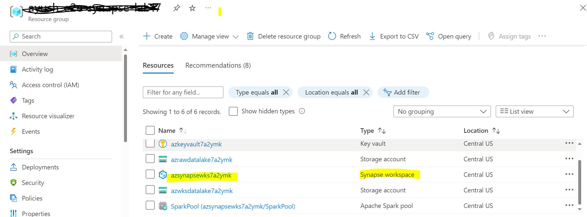  
   
3.	Open Synapse workspace and add yourself as Active directory Admin. 

 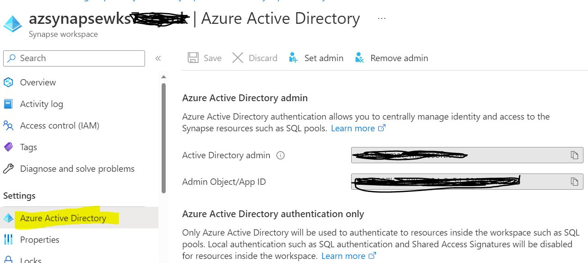
 
3. Select **_Overview_** and  Click **_Open_** to open synapse studio.

  

4. It will be redirected to synapse workspace.

    
    
5. If you get **Failed to load** message then add follow step 6, else skip step 6.

    
6.	Add yourself as the Synapse Administrator

 
 
7.	Synapse workspace and Storage account would be existing under below resources
8.	Note down the Raw Storage Account name, this will be used later in the lab.
•	Primary Storage Account name starts with azwksdatalake
•	Raw Storage Account name starts with azrawdatalake
•	Curated Storage Account name starts with azrcurateddatalake
•	Synapse Workspace name starts with azsynapsewks
This lab automatically grant workspace identity data access to the workspace Data Lake Storage Gen2 account, using the Storage Blob Data Contributor role. 

## Source Data:
•	This Lab uses Retail database as source  to quickly implement dataflows, datasets and integrate pipelines  for creating Facts and  dimensional tables.
Retail includes the following technical assets
•	Adventure Works sample CSV source files
•	Integration pipelines, Dataflows and datasets.
•	Staging and multi-dimensional lake databases

## 	Exercise to Data ingestion and transformation using Synapse pipelines and data flows
## Creating Data set from ADLS Gen2 storage

In this section, you will use ADLS Gen2 Storage to create datasets. These datasets will be used further for creating the Data Flows.

### Create Dataset-raw

1.	Go to *__Data__* -- > Select *__Linked__* -- > Select *__Integrated dataset__* . It will open New integration dataset.

    
    
1.	Select *__Azure Data Lake Storage Gen2__* --> *__Continue__* .

    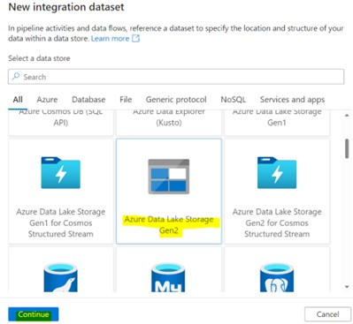
    
1.	Select *__Delimited Text__* and press *__Continue__*.

    

1.	Set properties by giving Name as **``raw``**  and select  *__azure raw data lake storage account__* as linked service.

1.	Set the  filepath to **``raw/SynapseRetailFiles``** and select **OK** .
    
    

1.  **Clear** schema under section **_Schema_**.

       

1.	Select  **+** under Parameter section to create parameters.
    Create parameter with Name as *__folderPath__* with default value **``@dataset().folderPath``**.
    
    
    
    
1. 	Under connections set folder path with  parameter value **``@dataset().folderPath``** and set ``first row as Header`` as **True**.

    

### Create Dataset - adworksraw

1.	Go to *__Data__* -- > Select *__Linked__* -- > Select *__Integrated dataset__* . It will open New integration dataset.
    
    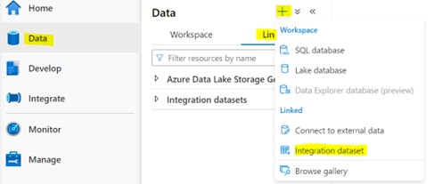

1.	Select *__Azure Data Lake Storage Gen2__* --> *__Continue__* .
    
    

1.	Select *__Delimited Text__* and press *__Continue__*.
    
    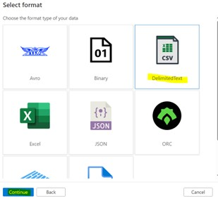

1.	Set properties by giving Name as **``adworksraw``**  and select  *__azure raw data lake storage account__* as linked service.
    
     

1.	Set the  filepath to **``raw/SynapseRetailFiles``** and select **OK** .

1.  **Clear** schema under section **_Schema_**.

       

1.	Select **+** under Parameter section to create parameters
    Create below mentioned two parameter:
       i.	Name as **``folderPath``** with default value **``@dataset().fileName``**.
      ii.	Name as **``fileName``** with default value **``@dataset().folderPath``**.
    
    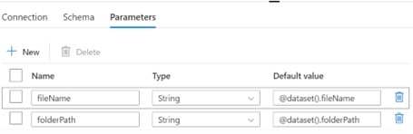

1.  Under connections set folder path with  parameter value **``@dataset().folderPath``**.
    set filename as **``@dataset().fileName``** and set first row as Header as **``True``**.
    
    

# Create Dataflow using the integration datasets

In this section, you will use integration datasets for creating a dataflow for loading data into lake database.

## Create Dataflow – adworks_DF

1.	Select **_Develop_** from menu then  click on **+**  and select option **_Dataflow_** and give name as **_``adworks_DF``_** under properties.

 
 
 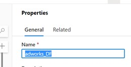
 
2.	Create new Parameter and name as **_``tableName``_**.

 
 
3.	Click on **Add source**, it will display prepopulated options. Then select **AddSource**.

 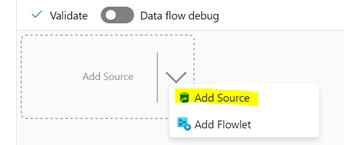

4.	Under source settings give 

5.	Output stream name as **_``CSVSource``_**.

6.	Select sourcetype **_integration dataset_** .

7.	Select dataset  as **_adworksraw_**.

8.	Set below options as **true**.

   i.	 Allow schema drift
  ii.  Infer drifted column types

  
  
9.	Select **+** icon beside CSVSource and select **_Sink_** as source.

  
  
10.	Set output stream name as **_``adworksSink``_**.

11.	Select incoming stream as **_CSVSource_**.

12.	Select Sinktype as **_WorkspaceDB_**.

13.	Select Database **_adworks_**.

14.	Set Table as **_``$tableName``_**.

  
  
15.	Select **_Recreate table_** as Table action under settings.

  
 
16.	Select **_Mapping_** and select below checkboxes
    
    i.	  Skip duplicate input column.
    
    ii.   Skip duplicate output column.
    
 

17. Then click on **Validate** to validate created dataflow. Once dataflow has been validated publish it.

# Create and run pipeline using the Data flow for loading the data to Lake database

In this section, you will use data flow for creating a pipeline for loading data into lake database.

## Create Pipeline

  1.	Select integrate then  **+** icon and select  **_Pipeline_**, Name it as **_``Load_CSV_data_to_adworks``_**

 
 
Select Variable to create below pipeline variables 

  i.	Give name as **_``adworksSourceFolderPath``_** with default value **_SynapseRetailFiles_** (foldername where csv files are located)
  
 ii.	Create one more variable with name **_``tableName_``** with empty default value.
  
  
  2.	Go to pipeline Activities then select and drag **_GetMetadata_** under **General** section 
   
   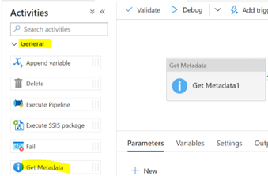
   
  3.	Click on **Get Metadata** to set below settings.
  
  4.	Select General section and give name as **_``Get File List``_**  and Timeout **_``7.00:00:00``_**
  
  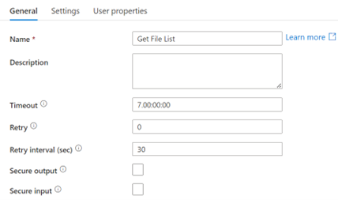
  
  5.	Select **Settings** and set dataset name as **_``raw``_**. 
  
  6.	After selecting dataset it will be populated with Dataset Properties.
  
  7.	Set folderPath to **_``@variables('adworksSourceFolderPath')``_**
  
  8.	Add FieldList by click on **+New** and select **ChildItem** from selection.
  
  
  
  9.	Add Output source as Foreach activity from Iteration & conditionals
  
  
     
  10.	Give name to foreach activity under section **General**.
   
  Select Section and select Sequential as **True** and  mention Items as **_``@activity('Get File List').output.childItems``_**
       
  11.	Double click on **Foreach** activity  to add activities.
  
  12.	Drag **Set Variable** activity from General activities and name it as **_``Set tableName``_**
   
  13.	Select Variables section and give Name as **_``tableName``_** and value as **_``@replace(item().name,'.csv','')``_**
   
  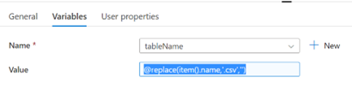
      
  14.	Add output source to **set variable** by clicking on **-->** and 
       add **Dataflow** activity  and name it as **_``Load adworks``_** ,set Timeout to **_``1.00:00:00``_**
   
   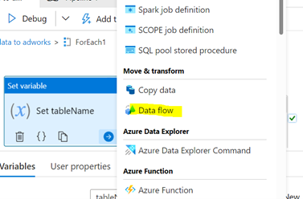
       
  15.	Select Section **Settings** and select dataflow as **adworks_DF**
   
  16.	Set CSVSourceParamters as below
        
        -Filename as **_``@item().name``_**
        
        -Folderpath as  **_``@variables('adworksSourceFolderPath')``_**
        
        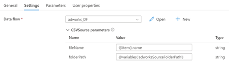
        
  17. Set parameter tableName value as **_``@variables('tableName')``_**
    
        
   
  18. Then Validate pipeline by clicking **_Validate_** and Publish it.
     
# Create Dataflow – FactSales_DF

1.	Open FactSales_DF under **_Develop -> DataFlows -> FactSales_DF_**

2.  Select AddSource  and name it as **_SalesSource_**,  add   sourcetype **_adworks_** and select  table **_Sales_**.

3.  Select **+** of SalesSource  to add dervived column under section **_schema modifier_** and name it as **_``SalesderivedColumn``_**.

4.  Add column with  name **_OrderDateId_** and expression **_toInteger(toString(OrderDate, "yyyyMMdd"))_**

6.	Add source **_Filter_** to SalesderivedColumn and name it as **_``ResellerFilter``_**

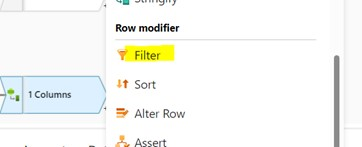

6.	Add **_Filter on_** expression as **_``!isNull(CustomerId)``_**

7.	Add Lookup to **_ResellerFilter_** by selecting LookUp  and Name it as **_``ResellerKeyLookup``_**.

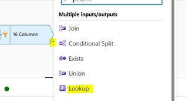

8.	Select  Lookup stram as **_``ResellerCustomerSelect``_** from dropdown and add lookup condition as **_``ResellerKeyLookup == ResellerId_lookup``_**

9.	Add Lookup  to ResellerKeyLookup and name it as **_``ProductKeyLookup``_** and select Lookup stream as **_``DimProductSelect``_** and add lookup condition as **_``ProductId==ProductId``_**

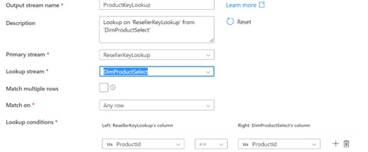

10.	Add Lookup  to ProductKeyLookup and name it as **_``DimDateKeyLookup``_** and select Lookup stream as **_``DimDateSelect``_** and add lookup condition as **_``OrderDateId==Date_lookup``_**

11.	Add source as **_``Select``_** to DimDateKeyLookup and name it as **_``FactSalesSelect``_**

12.	Select options **_Skip duplicate input columns_** and **_Skip duplicate output columns_**

13.	Set input columns as below

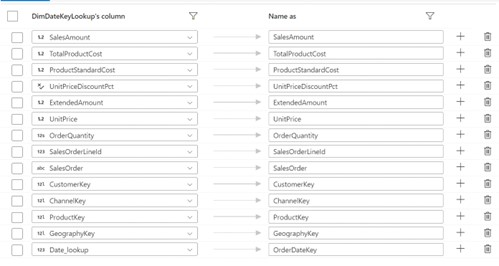

14.	Add source as **_``Sink``_** for destination to **_FactSalesSelect_** and name it as **_``FactSalesSink``_**

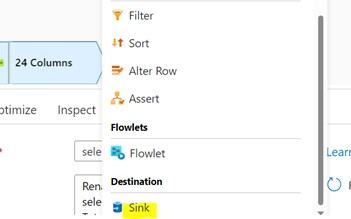

15. Select **_Sink type_** as **_``WorkspaceDB``_**, Database **_adworkstarget_** from dropdown and mention Table as **_``FactSales``_**.

16.	Click on **_Validate_** to  validate dataflow.

17. Once dataflow has been validated **_Publish_** dataflow.

## Run Pipelines for Loading Dimensions and Fact

1. Select **_Integrate_** and execute pipelines in below mentioned sequence.

2. Select **_IndependentDimensions_**, then click on **_Debug_** or select **_Trigger Now_** option under **_Add Trigger_**

- IndependentDimensions
- DependentDimensions
- FactTables 

