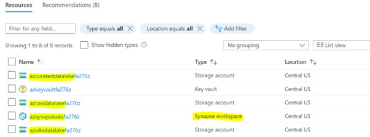
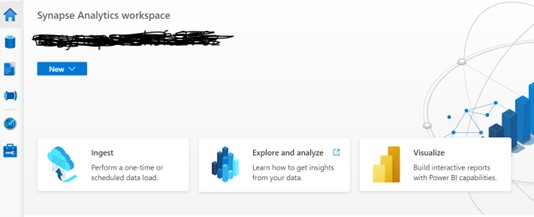

# Connect Synapse Workspace

In this lab, you will be redirected to the resource group and using below steps you can connect to Synapse workspace.

## Prerequisites

- 

## Synapse Workspace and Storage accounts

1. Synapse workspace and Storage account will be existing under resources

    -	Primary Storage Account name starts with **“azwksdatalake”**
    -	Raw Storage Account name starts with **“azrawdatalake”** 
    -	Curated Storage Account name starts with **“azrcurateddatalake”** 
    -	Synapse Workspace name starts with **“azsynapsewks”** 
    
    

2. Note down the Raw Storage Account name, this will be used later in the lab.
3. Select Synapse workspace. It will open synapse workspace overview.
4. Click “Open” to open synapse studio

5. It will be redirected to synapse workspace 

