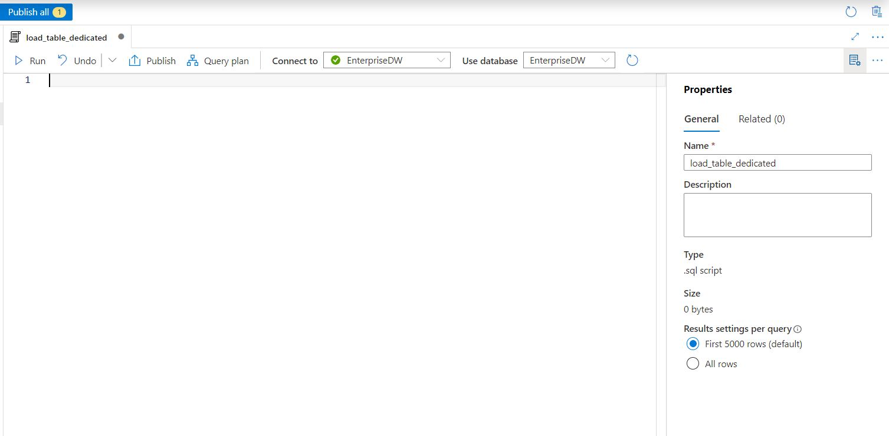

# SQL Script to load data using dedicated SQL Pool

In this section, you will use dedicated SQL Pool to load tables using the files stored in the ADLS Gen2 storage.

## Prerequisites

- None 


## Create Script

1. In Workspace open **Develop** from the left side navigation
2. Click on  **SQL Script** to open new sql script file.


3. In the properties section rename the script to **"load_table_dedicated"**
4. Select the **EnterpriseDW** from the Connect to dropdown.




6. Replace the "azrawStorageAccount" placeholder with the **Raw storage account** name before running the below sql script.

    ```sh
    eg. https://azrawdatalakefa256z.dfs.core.windows.net/raw/date.csv
    ```
	
6. For loading the **Date** table run the below query.

``` sql
COPY INTO [dbo].[Date]
FROM 'https://<azrawStorageAccount>.dfs.core.windows.net/raw/date.csv'
WITH
(
    FILE_TYPE = 'CSV',
	FIELDTERMINATOR = ',',
	FIELDQUOTE = ''
)
OPTION (LABEL = 'COPY : Load [dbo].[Date] - Taxi dataset');

```
4.  For creating the **Geography** table run the below query.

``` sql
COPY INTO [dbo].[Geography]
FROM 'https://<azrawStorageAccount>.dfs.core.windows.net/raw/Geography.csv'
WITH
(
    FILE_TYPE = 'CSV',
	FIELDTERMINATOR = ',',
	FIELDQUOTE = ''
)
OPTION (LABEL = 'COPY : Load [dbo].[Geography] - Taxi dataset');
```
5. For creating the **HackneyLicense** table run the below query

``` sql
COPY INTO [dbo].[HackneyLicense]
FROM 'https://<azrawStorageAccount>.dfs.core.windows.net/raw/HackneyLicense.csv'
WITH
(
    FILE_TYPE = 'CSV',
	FIELDTERMINATOR = ',',
	FIELDQUOTE = ''
)
OPTION (LABEL = 'COPY : Load [dbo].[HackneyLicense] - Taxi dataset');
```
6. For creating the **Medallion** table run the below query

``` sql
COPY INTO [dbo].[Medallion]
FROM 'https://<azrawStorageAccount>.dfs.core.windows.net/raw/Medallion.csv'
WITH
(
    FILE_TYPE = 'CSV',
	FIELDTERMINATOR = ',',
	FIELDQUOTE = ''
)
OPTION (LABEL = 'COPY : Load [dbo].[Medallion] - Taxi dataset');
```
7. For creating the **Time** table run the below query

``` sql
COPY INTO [dbo].[Time]
FROM 'https://<azrawStorageAccount>.dfs.core.windows.net/raw/Time.csv'
WITH
(
    FILE_TYPE = 'CSV',
	FIELDTERMINATOR = ',',
	FIELDQUOTE = ''
)
OPTION (LABEL = 'COPY : Load [dbo].[Time] - Taxi dataset');
```
8. For creating the **Trip** table run the below query

``` sql
COPY INTO [dbo].[Trip]
FROM 'https://<azrawStorageAccount>.dfs.core.windows.net/raw/Trip2013.csv'
WITH
(
   FILE_TYPE = 'CSV',
	FIELDTERMINATOR = ',',
	FIELDQUOTE = ''
)
OPTION (LABEL = 'COPY : Load [dbo].[Trip] - Taxi dataset');
```
9. For creating the **Weather** table run the below query

``` sql
COPY INTO [dbo].[Weather]
FROM 'https://<azrawStorageAccount>.dfs.core.windows.net/raw/Weather.csv'
WITH
(
    FILE_TYPE = 'CSV',
	FIELDTERMINATOR = ',',
	FIELDQUOTE = ''
	
)
OPTION (LABEL = 'COPY : Load [dbo].[Weather] - Taxi dataset');
```

## Validate loading data

1. In Workspace open **Data** from the left side navigation
2. Expand **SQL database**
3. Expand **EnterpriseDW (SQL)**
4. Expand **Tables**
5. Right click on any table then select **New SQL Script > Select TOP 100 Rows**.


7. Run the script to check the data loaded in the table.


