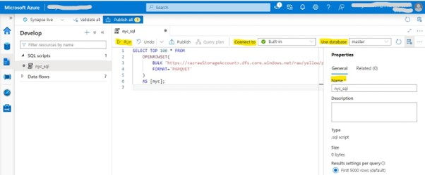
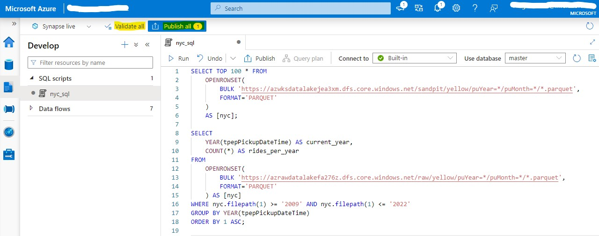

## SQL Script to run query using Serverless SQL Pool

### Authoring SQL Script and Run the SQL script:

1.	After opening Synapse Studio, navigate to **_Develop_** menu at left side, then select the **"+"** icon and choose SQL script.
     
     

1.	Copy and paste the snippet on the place given below in SQL Scripts section

1.	Choose the specific serverless SQL pool(built-in) from the Connect to drop-down menu. And  if necessary, database can be selected.

1.	In the properties section on the right pane renaming the notebook as  ``nyc_sql``

1.	Select the Run button to execute your SQL script and observe the results.
     
     
 
 **SQL Scripts**
 
 i. This query fetches top 100 records present in the mentioned path from azraw-storage_account.
   
```sql

SELECT TOP 100 * FROM
    OPENROWSET(
        BULK 'https:// azrawdatalakefa276z.dfs.core.windows.net/raw/yellow/puYear=*/puMonth=*/*.parquet',
        FORMAT='PARQUET'
    )
    AS [nyc];
```

ii. This query will fetch number of rides per every year in increasing order.

```sql

SELECT
    YEAR(tpepPickupDateTime) AS current_year,
    COUNT(*) AS rides_per_year
FROM
    OPENROWSET(
        BULK 'https://azrawdatalakefa276z.dfs.core.windows.net/raw/yellow/puYear=*/puMonth=*/*.parquet',
        FORMAT='PARQUET'
    ) AS [nyc]
WHERE nyc.filepath(1) >= '2009' AND nyc.filepath(1) <= '2022'
GROUP BY YEAR(tpepPickupDateTime)
ORDER BY 1 ASC;
```

iii. This query will fetch number of rides every day in date format with increasing order.

   ```sql

SELECT
    CAST([tpepPickupDateTime] AS DATE) AS [current_day],
    COUNT(*) as rides_per_day
FROM
    OPENROWSET(
        BULK 'https://azrawdatalakefa276z.dfs.core.windows.net/raw/yellow/puYear=*/puMonth=*/*.parquet',
        FORMAT='PARQUET'
    ) AS [nyc]
WHERE nyc.filepath(1) = '2022'
GROUP BY CAST([tpepPickupDateTime] AS DATE)
ORDER BY 1 ASC;
  ```
### Publishing the SQL Script

Once executing all the code cells. Click **_Validate All_** and **_Publish All_** at the top.


