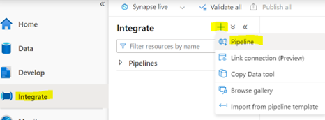

# Create and run pipeline using the Data flow for loading the data to Lake database

In this section, you will use data flow for creating a pipeline for loading data into lake database.

## Create Pipeline

  1.	Select integrate then  **+** icon and select  **_Pipeline_**, Name it as **_``Load CSV data to adworks``_**

 
 
Select Variable to create below pipeline variables 

  i.	Give name as **_``adworksSourceFolderPath``_** with default value **_SynapseRetailFiles_** (foldername where csv files are located)
  
 ii.	Create one more variable with name **_``tableName_``** with empty default value.
  
  
  2.	Go to pipeline Activities then select and drag **_GetMetadata_** under **General** section 
   
   
   
  3.	Click on **Get Metadata** to set below settings.
  
  4.	Select General section and give name as **_``Get File List``_**  and Timeout **_``7.00:00:00``_**
  
  
  
  5.	Select **Settings** and set dataset name as **_``raw``_**. 
  
  6.	After selecting dataset it will be populated with Dataset Properties.
  
  7.	Set folderPath to **_``@variables('adworksSourceFolderPath')``_**
  
  8.	Add FieldList by click on **+New** and select **ChildItem** from selection.
  
  
  
  9.	Add Output source as Foreach activity from Iteration & conditionals
  
  
     
  10.	Give name to foreach activity under section **General**.
   
  Select Section and select Sequential as **True** and  mention Items as **_``@activity('Get File List').output.childItems``_**
       
  11.	Double click on **Foreach** activity  to add activities.
  
  12.	Drag **Set Variable** activity from General activities and name it as **_``Set tableName``_**
   
  13.	Select Variables section and give Name as **_``tableName``_** and value as **_``@replace(item().name,'.csv','')``_**
   
  
      
  14.	Add output source to **set variable** by clicking on **-->** and 
       add **Dataflow** activity  and name it as **_``Load adworks``_** ,set Timeout to **_``1.00:00:00``_**
   
   
       
  15.	Select Section **Settings** and select dataflow as **adworks_DF**
   
  16.	Set CSVSourceParamters as below
        
        -Filename as **_``@item().name``_**
        
        -Folderpath as  **_``@variables('adworksSourceFolderPath')``_**
        
        
        
   1. Set parameter tableName value as **_``@variables('tableName')``_**
    
        
