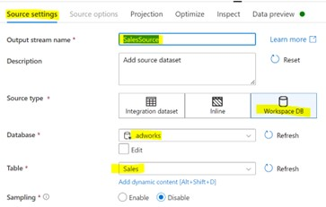
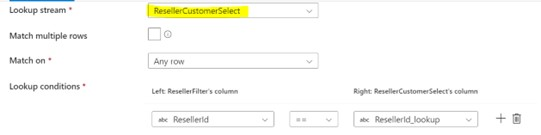
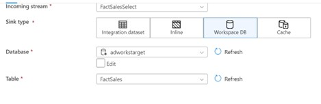

# Create Dataflow – FactSales_DF

1.	Open FactSales_DF under **_Develop-> DataFlows -> FactSales_DF_**

2.  Select AddSource  and name it as **_“SalesSource”_**,  add   sourcetype **_“adworks”_** and select  table **_“Sales”_**.

3.  Select **“+”** of SalesSource  to add dervived column under section **_“schema modifier”_** and name it as **_“SalesderivedColumn”_**.

4.  Add column with  name **_“OrderDateId”_** and expression **_“toInteger(toString(OrderDate, "yyyyMMdd"))”_**

6.	Add source **_“Filter”_** to SalesderivedColumn and name it as **_“ResellerFilter”_**

6.	Add **_“Filter on”_** expression as **_“!isNull(CustomerId)”_**

7.	Add Lookup to **_“ResellerFilter”_** by selecting LookUp  and Name it as **_“ResellerKeyLookup”_**.

8.	Select  Lookup stram as **_“ResellerCustomerSelect"_** from dropdown  and add lookup condition as **_“ResellerKeyLookup == ResellerId_lookup"_**

9.	Add Lookup  to ResellerKeyLookup and name it as **_“ProductKeyLookup”_** and select Lookup stream as **_“DimProductSelect”_** and add lookup condition as **_“ProductId==ProductId"_**

10.	Add Lookup  to ProductKeyLookup and name it as **_“DimDateKeyLookup”_** and select Lookup stream as **_“DimDateSelect”_** and add lookup condition as **_“OrderDateId==Date_lookup”_**

11.	Add source as **_“Select”_** to DimDateKeyLookup and name it as **_“FactSalesSelect”_**

12.	Select options **_“Skip duplicate input columns”_** and **_“Skip duplicate output columns”_**

13.	Set input columns as below

14.	Addsource as **_“Sink”_** for destination to **_“FactSalesSelect”_** and name it as **_“FactSalesSink”_**

15. Select **_“Sink type”_** as **_“WorkspaceDB”_**, Database **_“adworkstarget”_** from dropdown and mention Table as **_“FactSales”_**.

16.	Click on **_“Validate”_** to  validate dataflow.

17. Once dataflow has been validated **_“Publish”_** dataflow.
