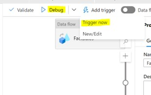

1. Select **_“Integrate”_** and execute pipelines in below mentioned sequence.

2. Select **_“IndependentDimensions”_**, then click on **_"Debug”_** or select **_“Trigger Now”_** option under **_“Add Trigger”_**

    - IndependentDimensions
    - DependentDimensions
    - FactTables 
