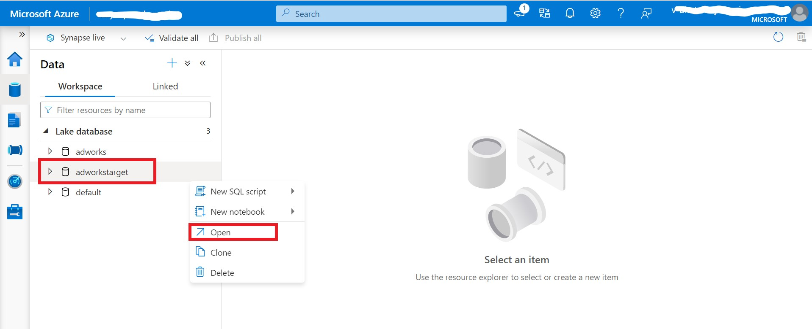
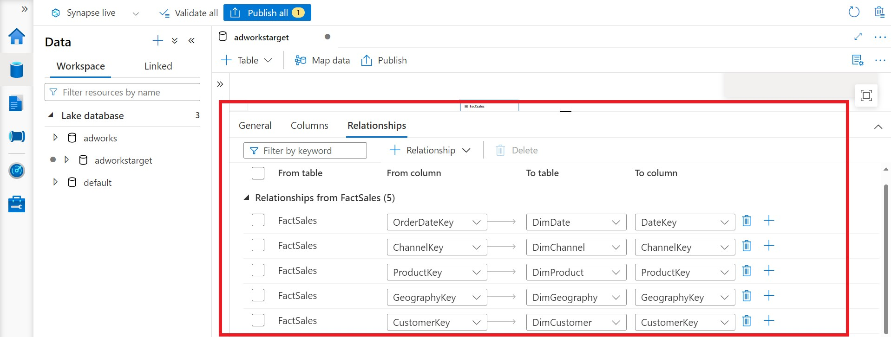
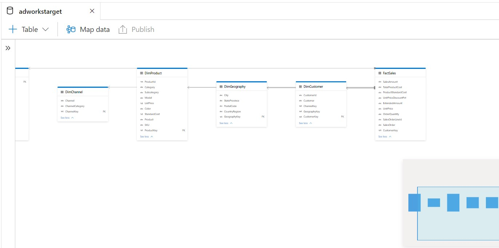

# Relationship between dimension and fact tables

## Steps to create relationships between tables :

1) User has to navigate to the synapse workspace.

1) On the left hand side , locate and click on the **_Data_** tab . Under **workspace** section you will find the **Lake database**.You need to select the **_``adworkstarget``_** database to create the relationship.
 
    

1) To open the **adworkstarget** lake database , right click on **adworkstarget** database and click on open.
    
     

1) To view all the tables , expand the **_Others_** section under Tables.You can select **_FactSales_** table on the canvas. It opens the table properties pane with    3 tabs i.e General, Columns, and Relationships.
   
     

1) The Relationship tab lists the incoming and outgoing relationships of the table with other tables on the canvas.Now you need to map a column of one table to column    of another table.

1) Using the drop-down next to **+ Relationship** tab option , select **_from table_** option.
 
     

1) For **_FactSales_** you need to create a relationship. Select a column **_``OrderDateKey``_** from **_FactSales_** tables(from table) and map it with **_``DateKey``_** column of **_DimTable_**( To Table) .

1) Repeat step 9 and 10 to create remaining relationships for FactSales. Make sure you create all the 5 relationships as mentioned in below snapshot.

    

1) After successful creation of relationships make sure you Validate by clicking on **_Validate all_**.

1) Once clicked on **_Publish all_** the workspace is saved and relationships between the fact and dim tables are seen on the Develop pane with lines attached between tables.
   
   
   
   
   
 
